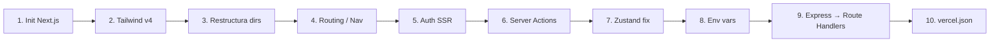

# Plan de Migración: Vite + React → Next.js (App Router)

## Stack actual

| Pieza | Actual | Next.js equivalente |
|---|---|---|
| Bundler | Vite 6 | Next.js (Turbopack) |
| Routing | `useState` manual (`ViewType`) | App Router (`/app`) |
| Auth | `useAuth` hook + `AuthGuard` | Supabase SSR + Middleware |
| Data fetching | Servicios en `src/services/` (client-side) | Server Components + Server Actions |
| Estado global | Zustand (`useAppStore`) | Zustand (compatible, solo client) |
| CSS | Tailwind v4 via `@tailwindcss/vite` | Tailwind v4 via `@tailwindcss/postcss` |
| Deploy | `vercel.json` (framework: vite) | `vercel.json` (framework: nextjs) |

---

## Paso 1 — Inicializar el proyecto Next.js

> Crear el proyecto paralelo o en una rama limpia.

```bash
# En una rama feature
git checkout -b feat/nextjs-migration

# Inicializar Next.js en el mismo directorio (sobreescribe configuración)
npx create-next-app@latest ./ \
  --typescript \
  --tailwind \
  --app \
  --src-dir \
  --import-alias "@/*" \
  --no-turbopack   # activar turbopack cuando sea estable en prod
```

**Decisión clave**: `--app` activa el App Router. NO usar Pages Router — ya estás en 2026, App Router es el estándar.

**Archivos que sobrescribe**: `package.json`, `tsconfig.json`, `next.config.ts` (nuevo). Guardar los valores que necesitás de los originales.

---

## Paso 2 — Migrar Tailwind v4

Tailwind v4 con Next.js usa `@tailwindcss/postcss` en lugar del plugin de Vite.

```bash
npm install tailwindcss@4 @tailwindcss/postcss
```

Crear `postcss.config.mjs`:
```js
export default {
  plugins: {
    '@tailwindcss/postcss': {},
  },
};
```

Tu `src/index.css` con `@import "tailwindcss"` funciona **sin cambios**. Las clases custom (`bg-warm-white`, `text-on-surface`) que tengas en `@theme {}` también son compatibles.

> [!WARNING]
> Si usás el plugin `@tailwindcss/vite`, ese no sirve en Next.js. Reemplazarlo por `@tailwindcss/postcss` es el único cambio necesario.

---

## Paso 3 — Restructurar directorios

```
src/
├── app/                          ← NUEVO (App Router)
│   ├── layout.tsx                ← Root layout (reemplaza index.html + main.tsx)
│   ├── page.tsx                  ← Redirect a /dashboard
│   ├── (auth)/
│   │   └── login/page.tsx        ← AuthGuard → página real
│   └── (app)/
│       ├── layout.tsx            ← Layout con Navigation
│       ├── dashboard/page.tsx    ← DashboardView
│       ├── projects/page.tsx     ← ProjectsView
│       ├── kanban/page.tsx       ← KanbanView
│       ├── tasks/page.tsx        ← TasksView
│       ├── timeline/page.tsx     ← TimelineView
│       ├── agile/page.tsx        ← AgileView
│       └── settings/page.tsx     ← SettingsView
├── components/                   ← Se mantiene igual (mover los existentes)
├── hooks/                        ← Se mantiene (useAuth → adaptado)
├── lib/
│   └── supabase/
│       ├── client.ts             ← supabaseClient.ts actual (browser)
│       ├── server.ts             ← NUEVO (cookies, para Server Components)
│       └── middleware.ts         ← NUEVO (session refresh)
├── services/                     ← Se convierte en Server Actions
├── store/                        ← Zustand se mantiene (solo `"use client"`)
└── types/                        ← Sin cambios
```

---

## Paso 4 — Migrar el routing (el cambio más grande)

El `useState<ViewType>` en `App.tsx` se convierte en URL-based routing.

**Antes** (`App.tsx`):
```tsx
const [currentView, setCurrentView] = useState<ViewType>('dash');
// renderizado condicional manual
```

**Después**: cada view es una página real. `Navigation.tsx` usa `<Link href="/dashboard">` en lugar de `onChange(view)`.

```tsx
// src/app/(app)/layout.tsx
import { Navigation } from '@/components/Navigation';

export default function AppLayout({ children }: { children: React.ReactNode }) {
  return (
    <div className="min-h-screen bg-warm-white text-on-surface font-sans flex flex-col md:pl-20">
      <Navigation />
      <main className="flex-1 w-full relative">{children}</main>
    </div>
  );
}
```

**`Navigation.tsx`**: cambiar `onChange(view)` → `router.push('/ruta')` o directamente `<Link>`.

---

## Paso 5 — Migrar Auth con Supabase SSR

El `useAuth` hook actual es 100% client-side. En Next.js necesitamos autenticación en el servidor para proteger rutas sin flash.

```bash
npm install @supabase/ssr
```

### 5a — Cliente browser (igual que ahora)
```ts
// src/lib/supabase/client.ts
import { createBrowserClient } from '@supabase/ssr';
export const supabase = createBrowserClient(
  process.env.NEXT_PUBLIC_SUPABASE_URL!,
  process.env.NEXT_PUBLIC_SUPABASE_ANON_KEY!,
);
```

### 5b — Cliente server (nuevo)
```ts
// src/lib/supabase/server.ts
import { createServerClient } from '@supabase/ssr';
import { cookies } from 'next/headers';

export async function createSupabaseServer() {
  const cookieStore = await cookies();
  return createServerClient(
    process.env.NEXT_PUBLIC_SUPABASE_URL!,
    process.env.NEXT_PUBLIC_SUPABASE_ANON_KEY!,
    { cookies: { getAll: () => cookieStore.getAll(), setAll: (c) => c.forEach(({ name, value, options }) => cookieStore.set(name, value, options)) } }
  );
}
```

### 5c — Middleware (protección de rutas)
```ts
// src/middleware.ts
import { createServerClient } from '@supabase/ssr';
import { NextResponse } from 'next/server';
import type { NextRequest } from 'next/server';

export async function middleware(request: NextRequest) {
  const response = NextResponse.next();
  const supabase = createServerClient(/* ... */);
  const { data: { session } } = await supabase.auth.getSession();

  if (!session && !request.nextUrl.pathname.startsWith('/login')) {
    return NextResponse.redirect(new URL('/login', request.url));
  }
  return response;
}

export const config = { matcher: ['/((?!_next/static|_next/image|favicon.ico).*)'] };
```

### 5d — `AuthGuard` → eliminar
Con el middleware activo, `AuthGuard` ya no tiene razón de existir. Las páginas protegidas son accesibles solo con sesión válida.

---

## Paso 6 — Convertir services en Server Actions

Los servicios actuales son llamadas Supabase client-side. En Next.js pueden convertirse en **Server Actions** para mayor seguridad (las keys no llegan al browser).

**Antes** (`taskService.ts` — client-side):
```ts
export async function getTasks() {
  const { data } = await supabase.from('tasks').select('*');
  return data;
}
```

**Después** (Server Action):
```ts
// src/services/taskService.ts
'use server';
import { createSupabaseServer } from '@/lib/supabase/server';

export async function getTasks() {
  const supabase = await createSupabaseServer();
  const { data } = await supabase.from('tasks').select('*');
  return data;
}
```

> [!NOTE]
> Los servicios que mutan datos (`createTask`, `updateTask`) se benefician especialmente de Server Actions porque la lógica de autorización corre server-side, no en el browser.

> [!TIP]
> Los Server Components pueden llamar a los services directamente (sin `useEffect`). Los Client Components siguen usando `fetch` o `startTransition` con Server Actions.

---

## Paso 7 — Adaptar Zustand (`useAppStore`)

Zustand funciona igual en Next.js, pero necesita la directiva `'use client'` y hay un gotcha con SSR.

```ts
// src/store/useAppStore.ts
'use client'; // ← agregar esto arriba
```

> [!CAUTION]
> Zustand con SSR puede causar **hydration mismatch** si el store se inicializa en server. La solución es usar `zustand/middleware` con `createJSONStorage` o un `StoreProvider` que solo inicialice en el browser.
>
> Si el store solo guarda estado local efímero (sin persistencia), simplemente agregar `'use client'` es suficiente.

El store actual **no persiste en localStorage**, así que no hay hydration mismatch real. Solo agregar la directiva.

---

## Paso 8 — Variables de entorno

Next.js tiene una convención distinta:

| Variable | Vite | Next.js |
|---|---|---|
| Pública (browser) | `VITE_` prefix | `NEXT_PUBLIC_` prefix |
| Privada (server only) | ❌ (todo es público en Vite) | Sin prefix |

En tu `.env` actual:
```env
# Renombrar
VITE_SUPABASE_URL → NEXT_PUBLIC_SUPABASE_URL
VITE_SUPABASE_ANON_KEY → NEXT_PUBLIC_SUPABASE_ANON_KEY

# Gemini API key: mover a server-only (sin prefix)
# VITE_GEMINI_API_KEY → GEMINI_API_KEY (solo en Server Actions/Route Handlers)
```

---

## Paso 9 — Migrar `express` (si aplica)

El `package.json` tiene `express` como dependencia. En Next.js, **Route Handlers** reemplazan a Express:

```ts
// src/app/api/[endpoint]/route.ts
export async function GET(request: Request) { /* ... */ }
export async function POST(request: Request) { /* ... */ }
```

Si el servidor Express es solo para dev proxy, eliminarlo completamente. Next.js maneja SSR y API routes nativamente.

---

## Paso 10 — Actualizar `vercel.json`

```json
{
  "framework": "nextjs"
}
```

Eso es todo. Vercel detecta Next.js automáticamente. Eliminar el bloque `rewrites` y el `outputDirectory: "dist"` — Next.js los maneja internamente.

---

## Orden de ejecución recomendado



---

## Riesgos y decisiones pendientes

| Riesgo | Impacto | Mitigación |
|---|---|---|
| `motion` (Framer Motion) | Medio | `motion` v12 es compatible con Next.js pero los componentes animados necesitan `'use client'` |
| `@google/genai` en client | Alto | Mover todas las llamadas a Gemini a Server Actions — la API key NO debe estar en el browser |
| Zustand hydration | Bajo | El store actual no persiste, agregar `'use client'` es suficiente |
| Tailwind v4 + PostCSS | Bajo | Plugin distinto al de Vite pero la sintaxis CSS es idéntica |
| `lucide-react` | Ninguno | Compatible, sin cambios |

> [!IMPORTANT]
> El riesgo más crítico es la **API key de Gemini**. En Vite está expuesta en el bundle del browser (con prefix `VITE_`). En Next.js, moverla a Server Actions la hace invisible para el cliente — este es el mayor win de seguridad de la migración.
